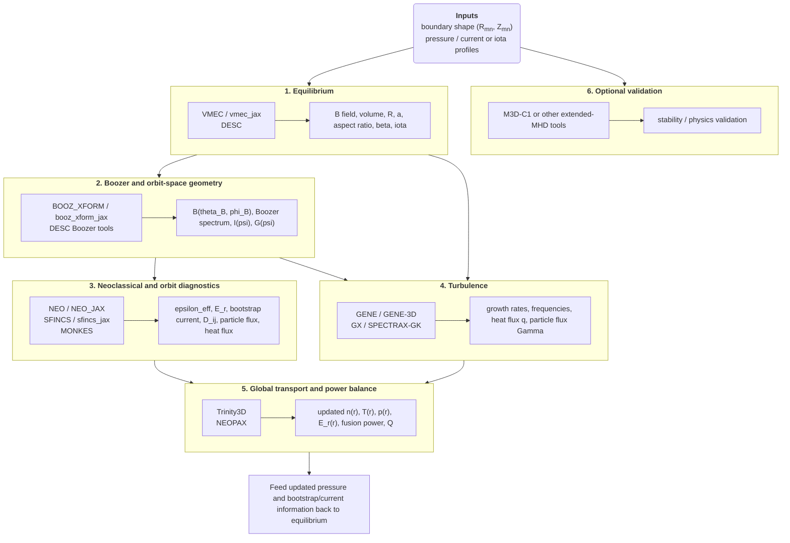

# Stellarator Design Workflow

This repository explains how a stellarator design loop turns a prescribed plasma
boundary and a set of profile guesses into transport-consistent profiles,
fusion-power estimates, and optimization metrics. The immediate software goal is
to make the workflow legible enough that the individual physics codes can be
packaged into interoperable containers and orchestrated as a single pipeline.

Fusion energy requires a plasma that is hot, dense, and confined long enough
for fusion reactions to outpace losses. Stellarators approach that problem by
shaping three-dimensional magnetic fields mostly with external coils. Because
confinement quality depends strongly on that 3D shape, stellarator design is
fundamentally an optimization problem: the same geometry that creates closed
flux surfaces also changes particle orbits, neoclassical transport, turbulence,
bootstrap current, and stability.

This repository focuses on one practical question: starting from boundary
Fourier coefficients and profile guesses, how do the major stellarator codes
connect to one another, and how do they lead to quantities such as heat flux,
ambipolar electric field, and fusion power?

The full manuscript, with governing equations and formal citations, is in
[stellarator_workflow.pdf](stellarator_workflow.pdf). The source is in
[stellarator_workflow.tex](stellarator_workflow.tex).

## From Fusion Energy to Stellarator Optimization

The design problem has three layers:

1. Fusion energy sets the top-level objective: achieve enough confinement and
   heating that fusion reactions produce useful power.
2. Stellarators are one magnetic-confinement path to that objective: they use
   externally generated 3D magnetic fields instead of relying primarily on a
   large toroidal plasma current.
3. Stellarator optimization is the engineering and physics loop that searches
   over shapes and profiles until the resulting device has acceptable transport,
   stability, and performance metrics.

That is why this workflow is a loop rather than a one-way pipeline. A candidate
boundary is not considered good simply because it supports an equilibrium. It
must also have acceptable orbit confinement, neoclassical transport, turbulent
transport, and global power balance after the profiles relax.

## Inputs and Final Outputs

We assume stellarator symmetry, so the plasma boundary is specified with cosine
`R_mn` and sine `Z_mn` coefficients:

```text
R(theta, phi) = sum_mn R_mn cos(m theta - n N_fp phi)
Z(theta, phi) = sum_mn Z_mn sin(m theta - n N_fp phi)
```

In VMEC this usually means `RBC(m,n)` and `ZBS(m,n)`. In DESC the same
physical surface is represented in its own spectral basis.

The profile inputs are typically:

- pressure `p(s)` or species profiles `n_s(s)` and `T_s(s)`,
- either rotational transform `iota(s)` or toroidal-current information,
- total toroidal flux or magnetic-field scale.

The outputs that matter by the end of the loop are broader than equilibrium
geometry alone:

- equilibrium geometry: major radius, minor radius, aspect ratio, volume,
  rotational transform, and beta,
- Boozer-space metrics: magnetic spectrum, quasi-symmetry error, and orbit
  proxies,
- neoclassical metrics: `epsilon_eff`, bootstrap current, ambipolar `E_r`,
  particle flux, and heat flux,
- turbulent metrics: growth rates, frequencies, nonlinear heat flux, and
  particle flux,
- whole-device metrics: transport-consistent `n(r)` and `T(r)`, fusion power,
  auxiliary power, and `Q = P_fus / P_aux`.

For the final device assessment, fusion power comes from the profiles produced
by the transport loop, not from the initial pressure guess:

```text
P_fus = integral( n_D n_T <sigma v>_DT E_DT dV )
```

with `E_DT ≈ 17.6 MeV` and the reaction rate commonly evaluated with the
Bosch-Hale parametrization.

## Workflow at a Glance



In plain terms:

1. Choose a boundary and initial profiles.
2. Solve for the 3D equilibrium.
3. Convert that equilibrium into the coordinate systems needed downstream.
4. Evaluate neoclassical and turbulent losses.
5. Evolve density and temperature profiles with those losses and with sources.
6. Recompute the equilibrium if the pressure or current profile changes.
7. Judge the design on the updated profiles and resulting power balance.

## Where Optimization Enters

Different codes produce different kinds of outputs, and not all of them play
the same role in an optimization loop.

- Some quantities are direct optimization targets, such as aspect ratio,
  boundary smoothness, quasi-symmetry error, `epsilon_eff`, or turbulent heat
  flux.
- Some quantities are direct transport inputs, such as neoclassical and
  gyrokinetic heat fluxes and particle fluxes.
- Some quantities are both, such as GX or GENE heat flux: it is a quantity to
  minimize, but it is also the quantity a transport solver needs.
- Some quantities are mainly screening diagnostics, such as `epsilon_eff` from
  NEO in workflows where Trinity3D does not explicitly evolve it.

That distinction matters when building a black-box workflow. It determines
which artifacts must be standardized as machine-readable interfaces and which
artifacts are mainly used for ranking candidate configurations.

## Code Map

| Code | Main role | Typical inputs | Typical outputs | Typical downstream or optimization role |
| --- | --- | --- | --- | --- |
| [VMEC](https://github.com/hiddenSymmetries/VMEC2000) / [vmec_jax](https://github.com/uwplasma/vmec_jax) | 3D ideal-MHD equilibrium | boundary coefficients, pressure, iota or current, toroidal flux | `wout`, geometry, beta, iota, field harmonics | upstream state for Boozer transforms, turbulence geometry, and profile loops |
| [DESC](https://github.com/PlasmaControl/DESC) | differentiable pseudo-spectral equilibrium and optimization | same physical inputs as VMEC | HDF5 equilibrium, geometry diagnostics, optimization objectives | replacement for VMEC when gradients and differentiability are important |
| [BOOZ_XFORM](https://github.com/hiddenSymmetries/booz_xform) / [booz_xform_jax](https://github.com/uwplasma/booz_xform_jax) | convert equilibrium to Boozer coordinates | VMEC- or DESC-like equilibrium | `boozmn`, Boozer `B_mn`, `I(psi)`, `G(psi)` | standard input for NEO, SFINCS, MONKES, and many symmetry diagnostics |
| [NEO](https://github.com/PrincetonUniversity/STELLOPT) / [NEO_JAX](https://github.com/uwplasma/NEO_JAX) | effective ripple and orbit diagnostics | Boozer Fourier data | `epsilon_eff`, trapped-particle diagnostics | usually a screening metric or optimization target rather than a transport state variable |
| [SFINCS](https://github.com/landreman/sfincs) / [sfincs_jax](https://github.com/uwplasma/sfincs_jax) | full neoclassical transport | Boozer geometry, species profiles and gradients, `E_r` guess | particle flux, heat flux, bootstrap current, `E_r`, `Phi_1`, transport matrices | direct input to profile evolution or direct optimization metric |
| [MONKES](https://github.com/f0uriest/monkes) | fast monoenergetic neoclassical coefficients | Boozer or DESC geometry, collisionality, energy, `E_r` | `D_ij` database | reduced neoclassical screening and database generation for NEOPAX |
| [GENE](https://genecode.org/license.html) / GENE-3D | high-fidelity gyrokinetic turbulence | geometry, species profiles, gradients, collisions, electromagnetic parameters | growth rates, frequencies, nonlinear fluxes | high-fidelity turbulent transport and validation |
| [GX](https://bitbucket.org/gyrokinetics/gx/src/gx/) / [SPECTRAX-GK](https://github.com/uwplasma/SPECTRAX-GK) | fast gyrokinetic turbulence, optimization-friendly | geometry, local profiles, gradients | growth rates, heat flux, particle flux | direct optimization target and direct transport input |
| [Trinity3D](https://bitbucket.org/gyrokinetics/t3d/src/main/) | global profile evolution and power balance | geometry, sources, neoclassical fluxes, turbulent fluxes | updated `n(r)`, `T(r)`, `p(r)`, fusion metrics, profile histories | closes the main profile loop |
| [NEOPAX](https://github.com/uwplasma/NEOPAX) | reduced JAX neoclassical transport loop | `D_ij` database, geometry, profiles, edge conditions | `E_r`, neoclassical fluxes, profile evolution, fusion metrics | reduced-order alternative to more expensive transport loops |

Two common sources of confusion are worth stating explicitly:

- `epsilon_eff` is valuable for optimization and screening, but it is not
  usually the quantity advanced by Trinity3D.
- GX or GENE heat flux is often both a metric to minimize and a direct input to
  global transport.

## Why the Final Profiles Differ From the Initial Profiles

The initial pressure and current profiles are usually starting guesses. After
the equilibrium is solved, the transport calculations reveal whether those
profiles are consistent with the modeled heating, particle sources, and losses.

That means the transport stage updates:

- density profiles `n_s(r)`,
- temperature profiles `T_s(r)`,
- ambipolar electric field `E_r(r)`,
- and often the bootstrap-current contribution.

Those updated profiles imply a new pressure profile:

```text
p(r) = sum_s n_s(r) T_s(r)
```

If the bootstrap current changes enough, the current profile can change as
well. The equilibrium therefore has to be recomputed with the updated profiles.
The quoted fusion power and device metrics should come from that transport-
consistent state, not from the initial equilibrium input.

## Literature Examples

The workflow described here is already visible in the literature, even when the
exact code choices vary.

- [Landreman and Paul (2022)](https://doi.org/10.1103/PhysRevLett.128.035001)
  showed precise quasi-symmetry optimization, combining equilibrium and
  Boozer-space analysis into a direct stellarator design loop.
- [Kim et al. (2024)](https://doi.org/10.1017/S0022377824000369) coupled DESC
  and GX inside an optimization loop, using turbulent heat flux as a direct
  objective.
- [Banon Navarro et al. (2023)](https://doi.org/10.1088/1741-4326/acc3af)
  demonstrated first-principles profile prediction for optimized stellarators
  with a gyrokinetic-plus-transport workflow.
- [Endler et al. (2021)](https://doi.org/10.1016/j.fusengdes.2021.112381)
  provide device-scale context through Wendelstein 7-X, an optimized
  stellarator built around the same broader physics goals: reduced transport,
  good confinement, and steady-state capability.

## Repository Contents

- [README.md](README.md): GitHub landing page and workflow summary.
- [stellarator_workflow.tex](stellarator_workflow.tex): full manuscript with
  equations and references.
- [stellarator_workflow.pdf](stellarator_workflow.pdf): compiled PDF.
- [references.bib](references.bib): bibliography used by the manuscript.

Build the PDF locally with:

```bash
make
```

## Selected References

- [Helander (2014), "Theory of plasma confinement in non-axisymmetric magnetic fields"](https://doi.org/10.1088/0034-4885/77/8/087001)
- [Bosch and Hale (1992), "Improved formulas for fusion cross-sections and thermal reactivities"](https://doi.org/10.1088/0029-5515/32/4/I07)
- [Landreman and Paul (2022), "Magnetic fields with precise quasisymmetry for plasma confinement"](https://doi.org/10.1103/PhysRevLett.128.035001)
- [Kim et al. (2024), "Optimization of nonlinear turbulence in stellarators"](https://doi.org/10.1017/S0022377824000369)
- [Banon Navarro et al. (2023), "First-principles based plasma profile predictions for optimized stellarators"](https://doi.org/10.1088/1741-4326/acc3af)
