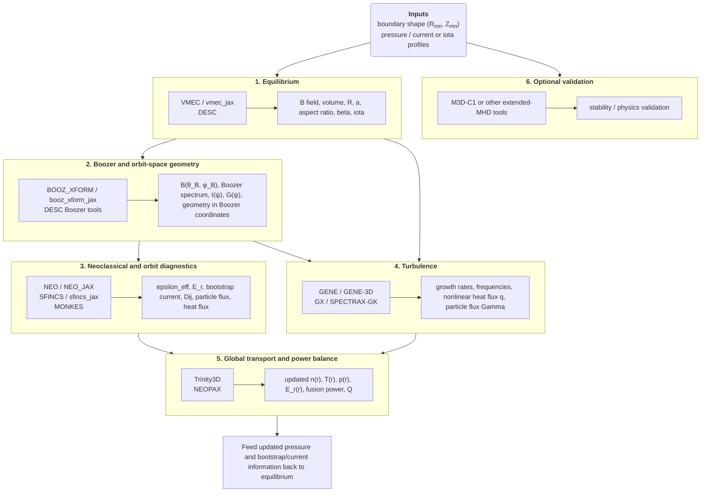

# Stellarator Workflow for Non-Experts

This repository explains, end to end, how a modern stellarator design workflow turns a fixed-boundary geometry and simple profile guesses into transport predictions, fusion power estimates, and optimization metrics.

The intended audience is not plasma specialists. The target use case is a future containerized "push-button" workflow in which the underlying physics codes are hidden behind a clean interface while still preserving the data contracts between them.

Files:

- [`stellarator_workflow.tex`](stellarator_workflow.tex): LaTeX source for the full document.
- [`stellarator_workflow.pdf`](stellarator_workflow.pdf): compiled PDF.
- [`references.bib`](references.bib): bibliography used by the PDF.

Build locally:

```bash
make
```

## 1. What goes in, and what comes out

We assume stellarator symmetry, so the plasma boundary is specified by the Fourier series

$$
R(\theta,\phi) = \sum_{m,n} R_{mn}\cos(m\theta - nN_{\mathrm{fp}}\phi),
$$

$$
Z(\theta,\phi) = \sum_{m,n} Z_{mn}\sin(m\theta - nN_{\mathrm{fp}}\phi).
$$

For VMEC this means the usual stellarator-symmetric boundary coefficients `RBC(m,n)` and `ZBS(m,n)`. For DESC the same surface is represented in its own spectral basis, but the physical input is the same.

The other required inputs are profile guesses:

- pressure, either directly as $p(s)$ or via species profiles with $p = \sum_s n_s T_s$,
- either rotational transform $\iota(s)$ or toroidal current / current-profile data,
- total toroidal flux or magnetic-field scale.

The outputs we ultimately care about are:

- equilibrium geometry: $R$, $a$, aspect ratio, volume, $\beta$, $\iota$,
- magnetic-geometry quality metrics: Boozer spectrum, quasi-symmetry error, trapped-particle and orbit proxies,
- neoclassical metrics: $\epsilon_{\mathrm{eff}}$, bootstrap current, ambipolar $E_r$, neoclassical particle and heat fluxes,
- turbulence metrics: linear growth rates, frequencies, nonlinear heat and particle fluxes,
- whole-device metrics: steady-state $n(r)$ and $T(r)$, fusion power, heating power, and $Q = P_{\mathrm{fus}}/P_{\mathrm{aux}}$.

At the end of a converged workflow, the physically relevant fusion power is computed from the final transport-consistent profiles, not from the initial pressure guess:

$$
P_{\mathrm{fus}}
=
\int dV \; n_D n_T \langle \sigma v \rangle_{DT} E_{DT},
\qquad
E_{DT} \approx 17.6\ \mathrm{MeV},
$$

with the Bosch-Hale parametrization typically used for $\langle \sigma v \rangle_{DT}$.

## 2. High-level workflow



The important point is that this is a loop, not a one-way pipeline. A non-expert should think of it as:

1. guess a geometry and profiles,
2. solve the equilibrium,
3. transform to the coordinates needed by transport codes,
4. compute neoclassical and turbulent losses,
5. evolve the density and temperature profiles,
6. update the equilibrium if the pressure or current profile changed.

## 3. Which outputs are passed downstream, and which are mostly optimization targets?

| Stage | Typical outputs | Usually passed to later codes? | Common direct optimization targets |
| --- | --- | --- | --- |
| VMEC / DESC | volume, $R$, $a$, aspect ratio, $\beta$, $\iota$, full equilibrium fields | Yes, to almost everything | aspect ratio, magnetic well, boundary smoothness, target $\iota$, target volume |
| BOOZ_XFORM | Boozer $B_{mn}$, Boozer geometry, $I(\psi)$, $G(\psi)$ | Yes, to NEO, SFINCS, MONKES, some gyrokinetic geometry tools | quasi-symmetry error, dominant symmetry-breaking modes |
| NEO / NEO_JAX | $\epsilon_{\mathrm{eff}}^{3/2}$, trapped-particle diagnostics | Usually no for Trinity3D; mostly a diagnostic/objective | minimize $\epsilon_{\mathrm{eff}}$, improve orbit confinement |
| SFINCS / sfincs_jax | ambipolar $E_r$, particle flux, heat flux, bootstrap current, $\Phi_1$ | Yes, if used as the neoclassical model in a transport loop | low neoclassical flux, favorable electron root / ion root behavior |
| MONKES | monoenergetic $D_{ij}$ database | Yes, for NEOPAX | fast bootstrap-current and radial-transport screening |
| GENE / GX / SPECTRAX-GK | growth rates, frequencies, nonlinear $q$, $\Gamma$ | Yes, when coupled to Trinity3D or another transport solver | low heat flux, low stiffness, low TEM/ITG drive |
| Trinity3D | updated $n(r)$, $T(r)$, sources, profile evolution, sometimes $Q$ estimates | It is usually the end of the profile loop | target temperature / density / power balance |
| NEOPAX | ambipolar $E_r$, neoclassical $\Gamma$, $Q$, profile evolution, fusion metrics | It can be an end-stage or a reduced transport loop | low neoclassical loss, desired $E_r$ and bootstrap behavior |

Two distinctions matter:

- `epsilon_eff` is extremely useful for optimization, but it is not the quantity a transport solver directly advances.
- GX or GENE heat fluxes often are both a direct optimization target and a transport input, because a transport solver uses those fluxes to update profiles.

## 4. Code-by-code summary

### 4.1 VMEC and vmec_jax

Plain-language role:
solve the 3D ideal-MHD equilibrium for a prescribed boundary and prescribed pressure/current data.

Governing equations:

$$
\nabla p = \mathbf{J}\times\mathbf{B},
\qquad
\nabla\cdot\mathbf{B}=0,
\qquad
\mathbf{J}=\frac{1}{\mu_0}\nabla\times\mathbf{B}.
$$

VMEC uses straight-field-line coordinates and minimizes the ideal-MHD energy functional

$$
W = \frac{1}{(2\pi)^2}\int \left(\frac{B^2}{2} + \frac{p}{\gamma-1}\right)\,dV.
$$

In the VMEC coordinate convention,

$$
u = \theta + \lambda(s,\theta,\zeta),
\qquad
\frac{du}{d\zeta} = \iota(s).
$$

The contravariant magnetic-field components reported by VMEC are

$$
B^\zeta = \frac{\Phi'(s) + \mathrm{lamscale}\,\partial_\theta \lambda}
{\mathrm{signgs}\,\sqrt{g}\,2\pi},
\qquad
B^\theta = \frac{\chi'(s) - \mathrm{lamscale}\,\partial_\zeta \lambda}
{\mathrm{signgs}\,\sqrt{g}\,2\pi}.
$$

Typical inputs:

- `input.NAME`,
- boundary Fourier coefficients `RBC`, `ZBS`,
- pressure coefficients `AM`,
- either iota coefficients `AI` or current coefficients `AC`,
- flux scale such as `PHIEDGE`.

Typical outputs:

- `wout_*.nc`,
- equilibrium Fourier coefficients,
- `aspect`, `Rmajor_p`, `Aminor_p`, `volume_p`, `betatotal`,
- pressure, iota, Jacobian, and magnetic-field harmonics on flux surfaces.

How it flows onward:

- `wout_*.nc` is the standard input to BOOZ_XFORM, GX geometry utilities, and many post-processing tools.
- its geometry metrics are also direct optimization objectives.

### 4.2 DESC

Plain-language role:
solve the same equilibrium problem as VMEC, but in an inverse, pseudo-spectral, differentiable formulation that is convenient for optimization.

DESC solves for the map $(R,Z,\lambda)$ from flux coordinates $(\rho,\theta,\zeta)$ to cylindrical coordinates. Its magnetic field in these coordinates is

$$
\mathbf{B}
=
\frac{\partial_\rho \psi}{2\pi\sqrt{g}}
\left[
\left(\iota - \frac{\partial \lambda}{\partial \zeta}\right)\mathbf{e}_\theta
+
\left(1 + \frac{\partial \lambda}{\partial \theta}\right)\mathbf{e}_\zeta
\right].
$$

The current density comes from Ampere's law,

$$
\mu_0 \mathbf{J} = \nabla\times\mathbf{B},
$$

and force balance is written as

$$
\mathbf{F} \equiv \mathbf{J}\times\mathbf{B} - \nabla p = 0.
$$

In practice DESC solves the collocated residual equations in radial and helical directions.

Typical inputs:

- a DESC input file or an imported VMEC input,
- boundary coefficients,
- pressure coefficients $p_l$,
- either $\iota_l$ or current coefficients,
- total toroidal flux $\Psi_a$.

Typical outputs:

- HDF5 equilibrium files,
- equilibrium surfaces and fields,
- geometry and optimization objectives, including fusion-power and magnetic-spectrum utilities.

How it flows onward:

- DESC can replace VMEC as the equilibrium engine.
- DESC outputs can be converted to Boozer coordinates and also used directly by MONKES.

### 4.3 BOOZ_XFORM and booz_xform_jax

Plain-language role:
convert a VMEC-like equilibrium into Boozer coordinates, because many stellarator transport metrics are simplest there.

Boozer coordinates satisfy

$$
\mathbf{B}
=
\nabla\psi\times\nabla\theta_B
+
\iota(\psi)\nabla\zeta_B\times\nabla\psi
=
\beta \nabla\psi + I(\psi)\nabla\theta_B + G(\psi)\nabla\zeta_B.
$$

Define the toroidal angle difference

$$
\zeta_B = \zeta_0 + \nu,
$$

and then the Boozer poloidal angle is

$$
\theta_B = \theta_0 + \lambda + \iota \nu.
$$

The angle-shift field is obtained from the covariant field components:

$$
B_{\theta_0}
=
\left(1+\frac{\partial\lambda}{\partial\theta_0}\right)I
+
(G+\iota I)\frac{\partial\nu}{\partial\theta_0},
$$

$$
B_{\zeta_0}
=
G + I\frac{\partial\lambda}{\partial\zeta_0}
+
(G+\iota I)\frac{\partial\nu}{\partial\zeta_0}.
$$

In Fourier form this yields

$$
\nu = \frac{w - I\lambda}{G+\iota I},
$$

with the Fourier coefficients of $w$ obtained from the original covariant field harmonics.

Typical inputs:

- VMEC `wout_*.nc` or equivalent equilibrium arrays,
- choice of Boozer resolution `(mboz, nboz)` or `in_booz.*`.

Typical outputs:

- `boozmn_*.nc`,
- Boozer harmonics `bmnc_b`, `rmnc_b`, `zmns_b`,
- angle-shift data `pmns_b`,
- Jacobian harmonics `gmn_b`,
- rotational transform and Boozer currents `iota_b`, `buco_b`, `bvco_b`.

How it flows onward:

- `boozmn` is the standard input to NEO and a standard geometry input for SFINCS.
- the Boozer spectrum is itself a quasi-symmetry optimization target.

### 4.4 NEO and NEO_JAX

Plain-language role:
estimate effective helical ripple and related trapped-particle quantities in the $1/\nu$ regime.

NEO follows field lines in Boozer coordinates and accumulates line integrals such as

$$
y_2 = \int d\phi \, B^{-2},
\qquad
y_3 = \int d\phi \, |\nabla\psi| B^{-2},
\qquad
y_4 = \int d\phi \, K_G B^{-3},
$$

and trapped-particle integrals over pitch parameter $\eta$:

$$
I_f = \int d\phi \, \sqrt{1-B/(B_0\eta)}\,B^{-2},
$$

$$
H_f = \int d\phi \, \sqrt{1-B/(B_0\eta)}
\left(\frac{4}{B/B_0} - \frac{1}{\eta}\right)
\frac{K_G}{\sqrt{\eta}} B^{-2}.
$$

The class-wise effective ripple contribution is

$$
\epsilon_{\mathrm{eff}}^{3/2}(m)
=
C_\epsilon \frac{y_2}{y_3^2}\,\mathrm{BigInt}(m),
\qquad
C_\epsilon = \frac{\pi R_0^2 \Delta\eta}{8\sqrt{2}},
$$

and the total `epstot` is the sum over trapped-particle classes.

Typical inputs:

- `boozmn_*.nc`,
- `neo_in.*` or `neo_param.*`,
- selected surfaces and angular resolution.

Typical outputs:

- `neo_out.*`,
- `epstot = \epsilon_{\mathrm{eff}}^{3/2}`,
- `epspar`,
- `reff`, `iota`, and optional current-related diagnostics.

How it flows onward:

- NEO output is usually a screening metric or optimization objective.
- it is normally not what Trinity3D evolves directly.

### 4.5 SFINCS and sfincs_jax

Plain-language role:
solve the stellarator neoclassical drift-kinetic equation with realistic collision operators, profiles, and optionally poloidally varying electrostatic potential.

The core first-order equation solved by SFINCS is a drift-kinetic equation for $f_{s1}$ around a Maxwellian $f_{sM}$. In one common form used by the code documentation,

$$
\left(
v_\parallel \mathbf{b}
+
\frac{d\Phi_0}{dr}\frac{\mathbf{B}\times\nabla r}{B^2}
\right)\cdot\nabla f_{s1}
+
\left[
-\frac{(1-\xi^2)v}{2B}\nabla_\parallel B + \cdots
\right]\frac{\partial f_{s1}}{\partial \xi}
$$

$$
-
(\mathbf{v}_{ms}\cdot\nabla r)
\frac{Z_s e}{2T_s x_s}
\frac{d\Phi_0}{dr}
\frac{\partial f_{s1}}{\partial x_s}
+
(\mathbf{v}_{ms}\cdot\nabla r)
\left[
\frac{1}{n_s}\frac{dn_s}{dr}
+
\frac{Z_s e}{T_s}\frac{d\Phi_0}{dr}
+
\left(x_s^2-\frac{3}{2}\right)\frac{1}{T_s}\frac{dT_s}{dr}
\right]f_{sM}
=
C_s[f_{s1}] + S_s.
$$

The collision operator is linearized and decomposed as

$$
C_s[f_s] = \sum_b C_{sb}^l[f_s,f_b],
\qquad
C_{ab}^l = C_{ab}^L + C_{ab}^E + C_{ab}^F.
$$

When $\Phi_1$ is retained, SFINCS simultaneously enforces quasineutrality:

$$
\lambda + \sum_s Z_s \int d^3v\,(f_{s0}+f_{s1}) = 0,
$$

together with gauge and moment constraints such as $\langle \Phi_1\rangle = 0$.

Typical inputs:

- `input.namelist`,
- Boozer geometry from `boozmn` or `.bc` files,
- species data, density and temperature gradients, electric-field guess, collisional model, radial location.

Typical outputs:

- `sfincsOutput.h5`,
- `particleFlux`, `heatFlux`, `FSABjHat`, `FSABFlow`, `transportMatrix`, `Phi1Hat`, and many diagnostics.

How it flows onward:

- SFINCS heat and particle fluxes can be passed directly into a global transport loop.
- bootstrap current and ambipolar $E_r$ can be fed back to equilibrium and turbulence stages.

### 4.6 MONKES

Plain-language role:
solve the monoenergetic drift-kinetic equation quickly, mainly to generate monoenergetic transport coefficients $D_{ij}$ for reduced transport models.

MONKES solves a Legendre-expanded monoenergetic DKE. In the JAX implementation, the pitch-angle block operators are

$$
L_k(f)
=
\frac{k}{2k-1}
\left[
\mathbf{b}\cdot\nabla f
+
\frac{k-1}{2}\frac{\mathbf{b}\cdot\nabla B}{B}f
\right],
$$

$$
U_k(f)
=
\frac{k+1}{2k+3}
\left[
\mathbf{b}\cdot\nabla f
-
\frac{k+2}{2}\frac{\mathbf{b}\cdot\nabla B}{B}f
\right],
$$

$$
D_k(f)
=
-\frac{\hat E_r}{\psi_r\langle B^2\rangle}\,
\mathbf{B}\times\nabla\psi\cdot\nabla f
+
\frac{k(k+1)}{2}\hat\nu\,f.
$$

The solver then forms source terms and computes the monoenergetic matrix

$$
D_{ij} =
\begin{pmatrix}
D_{11} & D_{12} & D_{13}\\
D_{21} & D_{22} & D_{23}\\
D_{31} & D_{32} & D_{33}
\end{pmatrix}
$$

from flux-surface averages of the solved distribution.

Typical inputs:

- Boozer or DESC magnetic field data on one surface,
- species Maxwellians,
- a radial electric field $E_r$,
- speed $v$ and Legendre resolution.

Typical outputs:

- monoenergetic coefficients `Dij`,
- perturbed distribution function,
- source vectors.

How it flows onward:

- the main downstream product is a database $D_{ij}(r,\nu,E_r)$ for NEOPAX.

### 4.7 GENE, GX, and SPECTRAX-GK

Plain-language role:
compute turbulent transport.

GENE and GX both solve the gyrokinetic equations, but with different numerical representations. A generic $\delta f$ gyrokinetic equation can be written as

$$
\frac{\partial h_s}{\partial t}
+
v_\parallel \mathbf{b}\cdot\nabla h_s
+
\mathbf{v}_{Ds}\cdot\nabla h_s
+
\mathbf{v}_E\cdot\nabla h_s
-
C[h_s]
=
-\frac{Z_s e F_{Ms}}{T_s}\frac{\partial \langle \chi \rangle}{\partial t}
-
\mathbf{v}_\chi\cdot\nabla F_{Ms},
$$

closed by quasineutrality and, in electromagnetic form, Ampere/Faraday-type field equations.

GX represents velocity space in a Hermite-Laguerre basis,

$$
h_s =
\sum_{\ell,m,k_x,k_y}
\hat h_{s,\ell,m}(z,t)
e^{i(k_x x + k_y y)}
H_m\!\left(\frac{v_\parallel}{v_{ts}}\right)
L_\ell\!\left(\frac{v_\perp^2}{v_{ts}^2}\right)
F_{Ms},
$$

which is why it is attractive for fast optimization loops.

Typical GENE / GX inputs:

- magnetic geometry, often from VMEC,
- species profiles and gradients,
- collisionality, beta, flow shear, box sizes, resolution, runtime controls.

Typical outputs:

- linear mode frequencies and growth rates,
- nonlinear heat and particle fluxes,
- spectra and field energies,
- NetCDF output files.

How they flow onward:

- the key downstream quantity is turbulent heat flux $q$ and, when needed, particle flux $\Gamma$.
- those fluxes are what Trinity3D needs.
- the same fluxes are often used directly as optimization objectives.

Practical distinction:

- GENE / GENE-3D are mature high-fidelity gyrokinetic tools, including global stellarator calculations.
- GX is a faster GPU-native local tool that is easier to place inside an optimization loop.
- SPECTRAX-GK is the in-progress JAX porting effort in this ecosystem.

### 4.8 Trinity3D

Plain-language role:
evolve the macroscopic density and temperature profiles using fluxes supplied by turbulence and neoclassical submodels.

The transport equations are effectively 1D conservation laws in radius. In continuous form they can be summarized as

$$
\frac{\partial n_s}{\partial \tau}
+
\mathcal{G}(\rho)\frac{\partial F_{n,s}}{\partial \rho}
=
S_{n,s},
$$

$$
\frac{\partial p_s}{\partial \tau}
+
\mathcal{G}(\rho)\frac{\partial F_{p,s}}{\partial \rho}
=
\frac{2}{3}S_{p,s},
$$

with $p_s = n_s T_s$ and geometry factor $\mathcal{G}$ derived from the VMEC geometry.

In the current implementation the implicit solve advances a stacked profile vector $y$ through

$$
\left(d_1 I + \alpha \Psi\right)y^{m+1}
=
-d_0 y^{m} - d_{-1} y^{m-1}
+
\alpha \Psi y^{m}
-
\alpha\left[G(F^+ - F^-) - S\right]
-
(1-\alpha)\left[G(F^+_m - F^-_m) - S_m\right].
$$

Typical inputs:

- T3D input TOML,
- VMEC geometry,
- initial density and temperature profiles,
- source terms,
- model templates for GX and, in stellarator tests, also SFINCS.

Typical outputs:

- updated radial profiles,
- flux histories,
- coupled GX and SFINCS run directories,
- profile predictions and sometimes fusion-related power metrics.

How it flows onward:

- Trinity3D is typically the end of the transport loop, after which the updated pressure should be sent back to equilibrium.

### 4.9 NEOPAX

Plain-language role:
provide a reduced, differentiable JAX neoclassical transport loop built on MONKES databases.

NEOPAX first converts monoenergetic transport coefficients into thermal transport matrices:

$$
\Gamma_a = -n_a\left(L_{11}A_1 + L_{12}A_2 + L_{13}A_3\right),
$$

$$
Q_a = -T_a n_a\left(L_{21}A_1 + L_{22}A_2 + L_{23}A_3\right),
$$

$$
U_{\parallel a}
=
-n_a\left(L_{31}A_1 + L_{32}A_2 + L_{33}A_3\right).
$$

In the current repository implementation, the monoenergetic database is sampled as $D_{11},D_{13},D_{33}$, velocity-convolved into $L_{ij}$, and then evolved with a `diffrax` time integrator. The ambipolar electric-field source is driven by charge-flux imbalance:

$$
S_{E_r} \propto -\Gamma_e + \Gamma_D + \Gamma_T.
$$

Typical inputs:

- MONKES-style $D_{ij}(r,\nu,E_r)$ HDF5 database,
- species profiles,
- geometry and radial grid,
- edge conditions and solver controls.

Typical outputs:

- ambipolar $E_r$,
- neoclassical $\Gamma$, $Q$, and $U_\parallel$,
- profile evolution,
- fusion-power related quantities if the corresponding physics modules are enabled.

How it flows onward:

- NEOPAX can act as a fast reduced transport stage when a full Trinity3D plus gyrokinetics loop is too expensive.

## 5. Why the final density and temperature profiles differ from the ones used to start VMEC or DESC

This is one of the most important conceptual points for non-experts.

The profiles used in the equilibrium step are often only a starting guess. They are needed because the magnetic equilibrium depends on pressure and current, but they are not yet transport-consistent.

The transport loop then changes those profiles because:

- neoclassical and turbulent fluxes depend on the local gradients of $n$ and $T$,
- external heating and particle sources reshape the profiles,
- the ambipolar electric field changes the neoclassical fluxes,
- bootstrap current changes the effective current profile,
- the total pressure is really $p = \sum_s n_s T_s$, so once $n_s(r)$ and $T_s(r)$ change, the pressure profile changes too.

A consistent stellarator design loop therefore looks like

$$
(R_{mn},Z_{mn},p,j)
\rightarrow
\text{equilibrium}
\rightarrow
\text{Boozer geometry}
\rightarrow
\text{transport fluxes}
\rightarrow
(n,T,E_r)
\rightarrow
p_{\mathrm{new}},j_{\mathrm{new}}
\rightarrow
\text{equilibrium again}.
$$

If the bootstrap current or pressure shifts are large enough, the magnetic geometry changes, so the downstream transport also changes. That is why the workflow must iterate.

## 6. Literature examples of this kind of workflow

Several published studies already use large pieces of the workflow described here:

- Landreman and Paul showed that one can optimize stellarator magnetic fields for extremely precise quasi-symmetry using modern equilibrium and Boozer-space objectives, yielding excellent orbit confinement benchmarks. This is the type of workflow represented by VMEC or DESC plus Boozer analysis plus ripple / fast-ion metrics.
- Kim et al. coupled DESC and GX directly inside an optimization loop to minimize nonlinear turbulent heat flux, and then used T3D to evaluate the resulting profile evolution. This is almost exactly the "heat-flux objective plus transport validation" branch of the flowchart.
- Bañón Navarro et al. coupled GENE-3D, KNOSOS, and a 1D transport solver to produce first-principles stellarator profile predictions. Even though the specific codes differ, the logic is the same as the SFINCS plus GENE / GX plus Trinity3D or NEOPAX loop described here.
- The new MONKES paper is explicitly motivated by the need for neoclassical metrics that are fast enough to sit inside stellarator optimization loops, exactly the role MONKES and NEOPAX play in this repository's workflow.

In other words, the "black-box stellarator workflow" is not a speculative idea. The main remaining work is engineering: containerization, standard interfaces, reproducibility, and orchestration.

## 7. Minimal data contracts for a future black-box workflow

For containerization, the most important design decision is not the UI. It is the file and object contracts between stages.

Recommended contracts:

- equilibrium container: accepts boundary Fourier coefficients and profile coefficients, returns a VMEC-compatible `wout` and a lightweight JSON summary of geometry metrics,
- Boozer container: accepts `wout`, returns `boozmn` plus a JSON summary of Boozer spectrum metrics,
- neoclassical container: accepts `boozmn` and profile gradients, returns `epsilon_eff`, bootstrap current, $E_r$, particle flux, and heat flux in a common HDF5 schema,
- turbulence container: accepts geometry plus local profile data, returns heat and particle fluxes in a common HDF5 or NetCDF schema,
- transport container: accepts fluxes plus source models, returns updated profiles and fusion metrics.

That engineering choice is what will make "one click" realistic.

## 8. References

The PDF contains BibTeX-formatted citations. The main references used here are:

1. Hirshman and Whitson, *Physics of Fluids* 26, 3553 (1983), [doi:10.1063/1.864116](https://doi.org/10.1063/1.864116).
2. Dudt and Kolemen, *Physics of Plasmas* 27, 102513 (2020), [doi:10.1063/5.0020743](https://doi.org/10.1063/5.0020743).
3. Panici et al., *Journal of Plasma Physics* 89, 905890406 (2023), [doi:10.1017/S0022377823000272](https://doi.org/10.1017/S0022377823000272).
4. Conlin et al., *Journal of Plasma Physics* 89, 905890512 (2023), [doi:10.1017/S0022377823000399](https://doi.org/10.1017/S0022377823000399).
5. Dudt et al., *Journal of Plasma Physics* 89, 905890405 (2023), [doi:10.1017/S0022377823000235](https://doi.org/10.1017/S0022377823000235).
6. Boozer, *Physics of Fluids* 26, 496 (1983), [doi:10.1063/1.864166](https://doi.org/10.1063/1.864166).
7. Nemov et al., *Physics of Plasmas* 6, 4622 (1999), [doi:10.1063/1.873749](https://doi.org/10.1063/1.873749).
8. Landreman et al., *Physics of Plasmas* 21, 042503 (2014), [doi:10.1063/1.4870077](https://doi.org/10.1063/1.4870077).
9. Escoto et al., *Nuclear Fusion* 64, 076030 (2024), [doi:10.1088/1741-4326/ad3fc9](https://doi.org/10.1088/1741-4326/ad3fc9).
10. Mandell et al., *Journal of Plasma Physics* 90, 905900402 (2024), [doi:10.1017/S0022377824000631](https://doi.org/10.1017/S0022377824000631).
11. Gorl{\"e}r et al., *Journal of Computational Physics* 230, 7053 (2011), [doi:10.1016/j.jcp.2011.05.034](https://doi.org/10.1016/j.jcp.2011.05.034).
12. Xanthopoulos et al., *Journal of Computational Physics* 402, 109694 (2020), [doi:10.1016/j.jcp.2020.109694](https://doi.org/10.1016/j.jcp.2020.109694).
13. Bosch and Hale, *Nuclear Fusion* 32, 611 (1992), [doi:10.1088/0029-5515/32/4/I07](https://doi.org/10.1088/0029-5515/32/4/I07).
14. Landreman and Paul, *Physical Review Letters* 128, 035001 (2022), [doi:10.1103/PhysRevLett.128.035001](https://doi.org/10.1103/PhysRevLett.128.035001).
15. Kim et al., *Journal of Plasma Physics* 90, 905900210 (2024), [doi:10.1017/S0022377824000369](https://doi.org/10.1017/S0022377824000369).
16. Bañón Navarro et al., *Nuclear Fusion* 63, 054003 (2023), [doi:10.1088/1741-4326/acc3af](https://doi.org/10.1088/1741-4326/acc3af).

Primary software repositories consulted while writing this document:

- [VMEC2000](https://github.com/hiddenSymmetries/VMEC2000)
- [vmec_jax](https://github.com/uwplasma/vmec_jax)
- [DESC](https://github.com/PlasmaControl/DESC)
- [booz_xform](https://github.com/hiddenSymmetries/booz_xform)
- [booz_xform_jax](https://github.com/uwplasma/booz_xform_jax)
- [SFINCS](https://github.com/landreman/sfincs)
- [sfincs_jax](https://github.com/uwplasma/sfincs_jax)
- [STELLOPT / NEO](https://github.com/PrincetonUniversity/STELLOPT)
- [NEO_JAX](https://github.com/uwplasma/NEO_JAX)
- [MONKES](https://github.com/f0uriest/monkes)
- [GENE](https://genecode.org/license.html)
- [GX](https://bitbucket.org/gyrokinetics/gx/src/gx/)
- [SPECTRAX-GK](https://github.com/uwplasma/SPECTRAX-GK)
- [Trinity3D](https://bitbucket.org/gyrokinetics/t3d/src/main/)
- [NEOPAX](https://github.com/uwplasma/NEOPAX)
